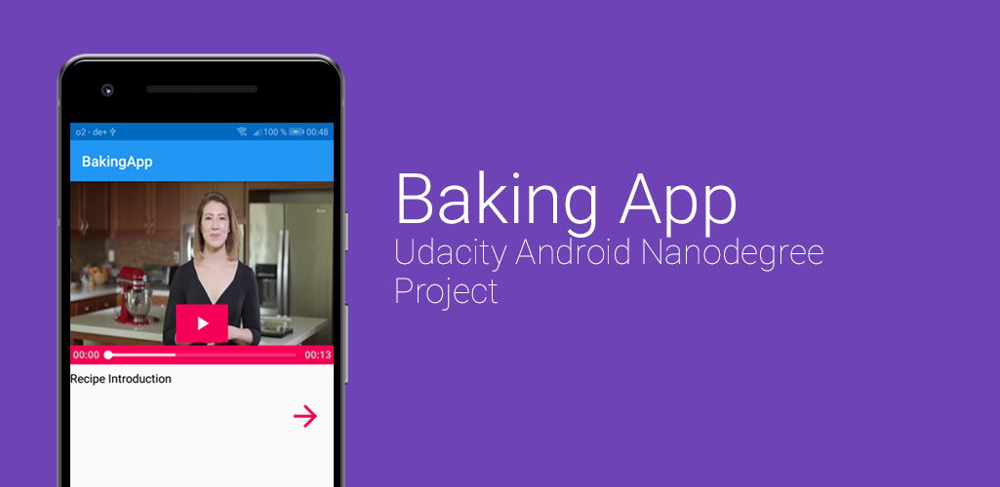

## Project Overview
The Baking App Project from the Udacity Android Developer Nanodegree.

## What i did
- Created the App from scratch
- Processed the JSON data (parsed it)
- Build/Designed the layout
  - Smartphone
  - Tablet layout
- Implemented ExoPlayer
- Implemented Espresso Tests
